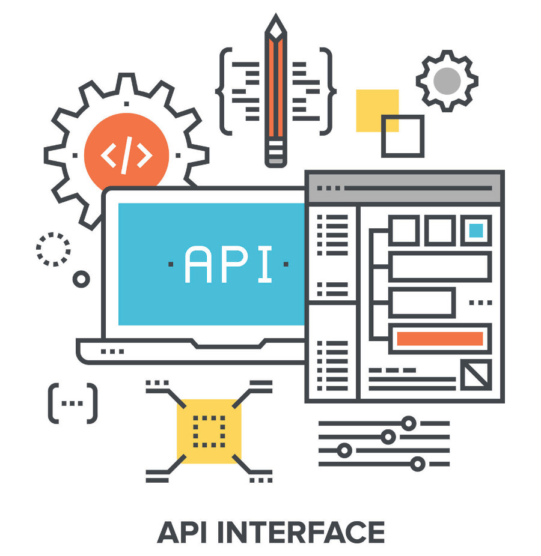

# Build-APIs-with-Flask-Course

This repo consists of content material for a swahili flask course hosted on barmaga.io for getting started building restful API with Flask



## what will you build ?

In this course we are going to build a tourism API where by tour providers/ hosts can interact with to mention their future tour together with their location/pricing, images and any additional information and deploy it to Heroku cloud.


## Tools & Libraries to be used
- API Testing
  - [Insomia](https://insomnia.rest/)

- Editor
  - [VScode](https://code.visualstudio.com/)

- Libraries 
  - [Flask](https://flask.palletsprojects.com/en/1.1.x/) (Web framework)
  - [Flask-sqlalchemy](https://flask-sqlalchemy.palletsprojects.com/en/2.x/) (SQLAlchemy db)
  - [Flask-migrate](https://flask-migrate.readthedocs.io/en/latest/) (Handling migration)
  - [Flask Marshmallow](https://flask-marshmallow.readthedocs.io/en/latest/) (Serialization and Deserialization)
  - [Fast-restx](https://flask-restx.readthedocs.io/) (Simplifying building API)

- Hosting
  - [Heroku](https://www.heroku.com/)

## Running locally

To be able to run the project locally do the following 

- Clone | Download the repository

```bash
git clone https://github.com/Kalebu/Build-APIs-with-Flask-Course
cd Build-APIs-with-Flask-Course
Build-APIs-with-Flask-Course -> pip install -r requirements.txt
Build-APIs-with-Flask-Course ->python3 route.py
```

## Issues ?

If you have encountered any issue while trying to run the repository please raise an issue and I will work to fixing it as soon as I can

## Credits

All the credits to [kalebu](https://github.com/kalebu) and [Barmaga.io](#https://barmaga.io/)